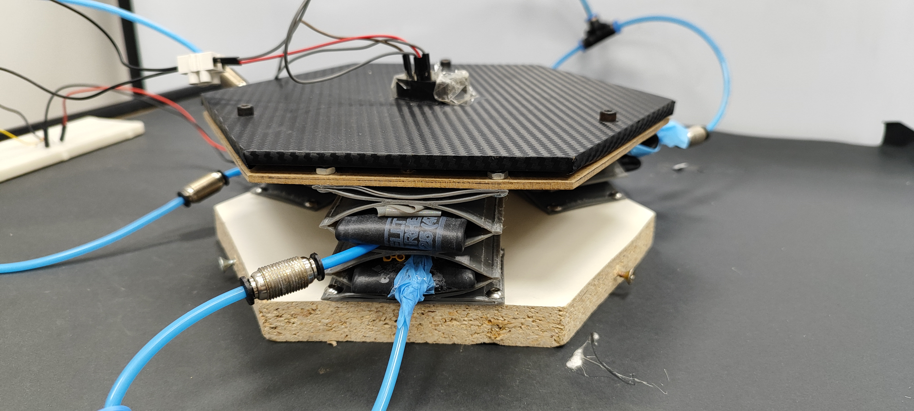

# PETER
This repository contains the necessary tools to work with the PETER robot.
PETER is a modular pneumatic robot. Each module consists of 3 degrees of freedom. Low level control is done with Arduino and high level control with Python.

**To cite:** García-Samartín, J.F., Charles, M., del Cerro, J. and Barrientos, A., PETER: a Soft Pneumatic Manipulator with High Resistance and Load Capacity, 2024

## Code structure
*  **Code_arduino:** low-level control code
*  **Code_python:** high-level control code
    *  **Tools:** developped libraries (i.e. for kinematic modelling)
    *  **results:** results of the different tests carried out
    *  The primary folder contains the data set utilized for network training, the trained network itself, and the programs employed for training and movement testing.
*  **STL:** files used for the 3D-printing of the robot, using TPU 95A.

## Videos
Some demo videos are available at https://drive.upm.es/s/sdvQicT6XiMP1li 
